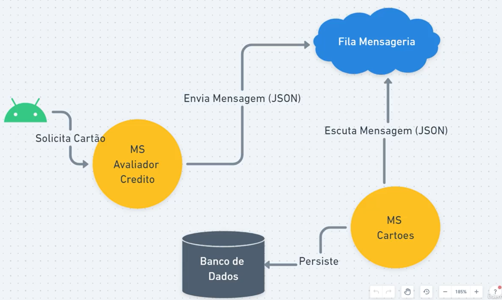

# Domine Microserviços e Mensageria com spring Cloud e Docker

## Autor: Douglas Sousa

## Endereço: [Udemy](https://www.udemy.com/course/domine-microservicos-e-mensageria-com-spring-cloud-e-docker/)

## [https://start.spring.io/](https://start.spring.io/#!type=maven-project&language=java&platformVersion=3.1.6&packaging=jar&jvmVersion=17&groupId=com.jnsdev.cursoudemy&artifactId=msclientes&name=msclientes&description=Clientes%20Microservices&packageName=com.jnsdev.cursoudemy.msclientes&dependencies=web,lombok,devtools,h2)

## Sobre este curso
Aprenda a construir um arquitetura completa com Microservices, Serviços de Mensageria, RabbitMQ, Keycloak e muito mais.

## O que você aprenderá
- Desenvolver Arquitetura Completa de Microservices
- Spring Cloud, Service Discovery, Api Gateway
- Spring Cloud Open Feign para comunicação Sícrona entre os Microservices
- Serviços de Mensageria com RabbitMQ
- Authorization Server com Keycloak
- Buildar Imagens Docker e criar containers a partir delas

# Clientes Microservice

 ## 1. Salvar Cliente:

  **POST**

  input - JSON: 

  ```JSON
    { 
      "cpf": string, 
      "nome": string, 
      "idade": int 
    }
  ```

  output: Header Location

## 2. Obter dados Cliente por CPF:

   **GET**

   input - Request Param: { cpf }

   output: 

  ```json
    { 
      "id": int, 
      "cpf": string, 
      "nome": string, 
      "idade": int 
    }
  ```

# Cartões Microservice

 ## 1. Cadastra Cartao:
  
  **POST**

  input - JSON: 
  ```json
  { 
    nome: string, 
    bandeira: string, 
    renda: number,
    limite: number 
  }
  ```
  output: Created - No content
  
 ## 2. Listar Cartões por renda até:
  
  **GET**
  
  input - Request Param: { renda: number }
  
  output: 
  ```json
  [
    { 
      "id": int,
      "nome": string, 
      "bandeira": string, 
      "renda": number,
      "limiteBasico": number 
    }
  ]
  ```

## 3. Lista Cartões Por Cliente:
  
  **GET**

  input - Request Param: { cpf }

  output: 
  ```json
    {
      "nome": string, 
      "bandeira": string, 
      "limite": number
    }
  ```  

# Avaliador de Crédito

## 1. Consulta Situação Cliente:
  
  **GET**
  
  input - Request Param: { cpf }
  
  output: 
  ```json
    {
      "dadosCliente":{...}, 
      "cartoes": [...] 
    }
  ```

## 2. Realizar Avaliação Cliente:
  
  **POST**
  
  input - JSON: 
  ```json
    { 
      "cpf": string, 
      "renda": decimal 
    }
  ```
  output: 

   ```json
    [
      { 
        "cartao": string, 
        "bandeira": string, 
        "limiteAprovado": number
      }
    ]
  ```

## 3. Solicita Cartao:

**POST**

input - JSON: 
```json
{ 
  "idCartao": number, 
  "cpf": string, 
  "endereco": string
}
```
output - JSON 
```json
{ 
  "protocolo": string 
}  
```



# latest RabbitMQ 3.12
```
docker run -it --rm --name rabbitmq -p 5672:5672 -p 15672:15672 rabbitmq:3.12-management
```
senha: guest